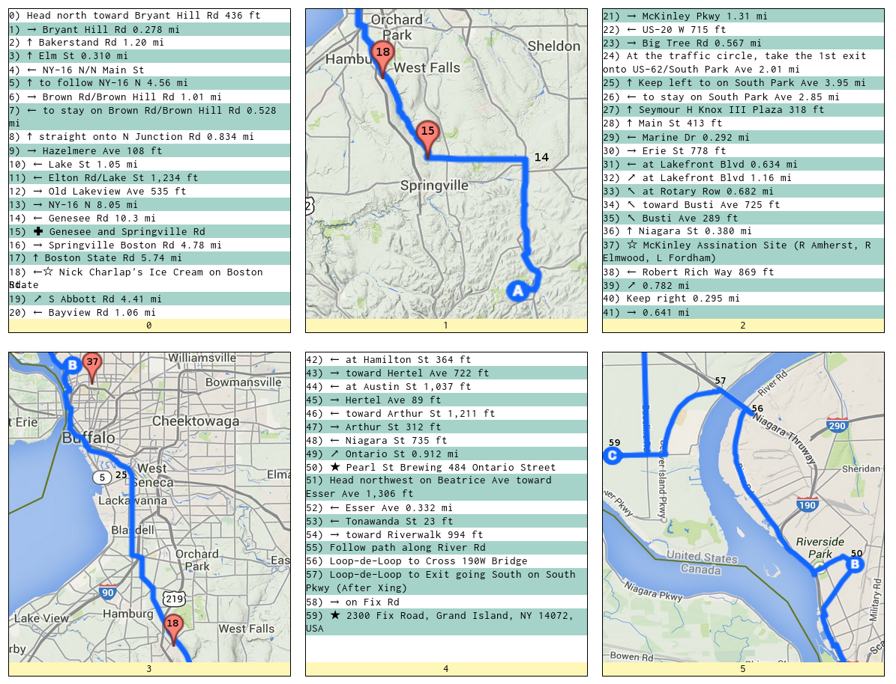

bbtxlbwny_cues
==============

Copy and paste directions from google maps into day<00>.txt into this directory
I delete the total distances under each destination and replace the google address
`Arrive: Place, shortened address`

run `python process_directions.py`

This will create a bunch of html files. You can then go and make snapshots from google maps, labelling turns.

If you just drop those images into this directory, then they'll show up. To print, you may need to adjust your
browser settings to print background colors and print in landscape mode.

TODO:
Manunally Add points of interest, sag, etc. Syntax follows

syntax for these things

* POI: NAME OF THING
* SAG: Location
* No Turn: denotes turn without sign
* Add Images, map\_dayXX\_pgXX.png (see alt txt) 

Screen shot of cue sheets

